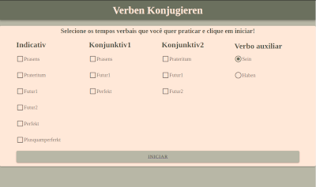
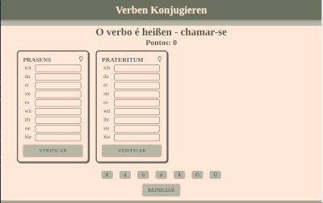

## O que é este projeto?
Este projeto se trata de um projeto de estudos e prática de conjugação de verbos em alemão.
O projeto se constitui de uma tela inicial onde é possível escolher o tempo verbal e o modo dele que se dejesa treinar (podem ser escolhidos até 5 tempos). Um verbo auxiliar também precisa ser selecionado, e é possível optar entre o verbo **sein** ou **haben**. 

Uma vez selecionas as conjugações que se deseja praticar, é preciso clicar em iniciar, o que abrirá uma segunda página com bloquinhos para que o usuário digite as conjugações de um verbo escolhido aleatóriamente que é mostrado na tela. Teclas de caracteres especiais da língua alemã estão disponívies também nesta página e clicando em um botão correspondente ao caracter que você deseja inserir, este será inserido na entrada onde o seu mouse estiver posicionado.

É possível ver as respostas das conjugações de cada tempo clicando na lâmpada no card de cada tempo, e para verificar as suas respostas você pode clicar no botão de verificar referente ao tempo que dejesa verificar. Pontos serão calculados com esta verificação, e o espaço de escrita ficará colorido indicando se sua resposta está ou não correta. 

Para reiniciar a aplicação, basta clicar em **reiniciar**, o que vai te redirecionar novamente para a página inicial.

## Como este projeto está estruturado?
O projeto é desenvolvido em Vue, utilizando o vue-cli, e a aplicação se encontra dentro da pasta **verben**. Dentro dessa pasta existem outras pastas importantes:

- assets: contém arquivos .txt que armazenam uma lista de verbos e sua tradução. Uma destas listas é definida como sendo a fonte dos verbos aleatórios da aplicação.
- components: componentes Vue básicos da aplicação
- plugins: declaração do Vuetify que é a biblioteca de componentes utilizada na aplicação
- router: contém o vue-router para a movimentação entre os componentes
- vuex: contém a store que representa o estado centralizado da aplicação.

## Como utilizar este projeto?
Para utilizar este projeto, é preciso fazer o download do repositório e uma vez na pasta raís do repositório, você deve entrar na pasta **verben** e rodar o comando `npm run serve` em um terminal. Isso irá executar servidor de desenvolvimento, e rodará a aplicação em uma das portas da sua máquina, que pode ser acessada através de **http://localhost:PORTA** na sua máquina, ou através de  **http://SEUIP:PORTA** na rede local. Esses endereços serão exibidos após o programa estar rodando.

## Principais dependências do projeto:
- Vuetify: biblioteca de componentes gráficos do Vue
- German Verbs e German Verns Dict: pacotes do node utilizados para realizar a conjugação dos verbos em alemão
- vue-router: necessário para montar a single-page application
- vuex: utilizado para montar o estado centralizado da aplicação.

## Links úteis
- [Paleta de cores do projeto](https://coolors.co/cb997e-ddbea9-ffe8d6-b7b7a4-a5a58d-6b705c)
- [Pacote German Verbs](https://www.npmjs.com/package/german-verbs)
- [Pacote German Verbs Dict](https://www.npmjs.com/package/german-verbs-dict)
